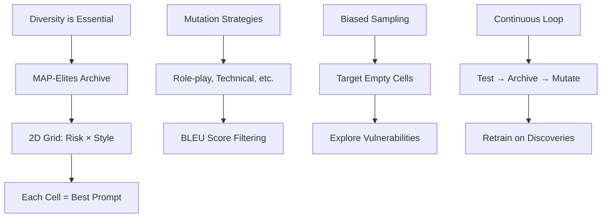

# Open-Ended Teaming for AI Safety Research
*Reference: Rainbow Teaming Paper Implementation Notes*

## Key Concepts from Rainbow Teaming Applied

### 1. MAP-Elites Archive Structure
- Two-dimensional grid organized by behavioral characteristics
- Each cell stores the best-performing prompt for that characteristic combination
- Promotes diversity in discovered adversarial examples

### 2. Preference-Based Evaluation
- Instead of using absolute scores, compare prompts pairwise
- More robust to judge miscalibration
- Better captures relative effectiveness of attacks

### 3. Mutation Strategies
- Apply targeted mutations based on desired characteristics
- Filter out prompts too similar to parent (BLEU score threshold)
- Multiple mutation types: role-play, technical language, emotional appeals, etc.

### 4. Biased Sampling
- Sample target cells biased toward empty or low-fitness regions
- Encourages exploration of under-tested attack vectors
- Temperature parameter controls exploration vs exploitation

### 5. Continuous Improvement
- Periodically retrain judge on discovered adversarial examples
- Track judge robustness over generations
- Identify persistent vulnerabilities

## Implementation in Guardian-Loop

The Open-Ended approach enhances Guardian-Loop by:
1. Structuring the adversarial search space
2. Promoting diverse attack discovery
3. Enabling systematic vulnerability mapping
4. Supporting iterative judge improvement

## Original Paper Information

Below is the content from the Rainbow Teaming paper that inspired our Open-Ended implementation:

---

# Rainbow Teaming: Open-Ended Generation of Diverse Adversarial Prompts
### Anonymous authors

Paper accepted to **NeurIPS 2024**

## Abstract

As large language models (LLMs) become increasingly prevalent across many real-world applications, understanding and enhancing their robustness against adversarial attacks is of paramount importance. Through
**Rainbow Teaming**, we generate a diverse collection of adversarial prompts to identify vulnerabilities in
state-of-the-art LLMs. Rainbow Teaming casts adversarial prompt generation as a *quality-diversity problem*,
and uses *open-ended search* to generate prompts that are both effective and diverse. This approach leverages an
*archive of adversarial prompts* categorised based on their *effectiveness* against the target LLM and *diversity*
across any customisable dimensions such as topic, style, and intended harmfulness. It iteratively *mutates*
and *selects* prompts from the archive to generate new ones, ensuring that the collection remains diverse
and effective. We apply Rainbow Teaming to the safety domain, demonstrating that it can uncover a
model's vulnerabilities across a wide range of categories and attack styles, including identifying 200+
safety vulnerabilities in the Llama 2 and Llama 3 models. In addition, we show that the discovered
adversarial prompts are transferable and can be used to attack other LLMs, including closed-source models
such as GPT-4. Finally, we demonstrate that the prompts generated by Rainbow Teaming can be used for
fine-tuning, reducing the attack success rate (ASR) on previously unseen adversarial prompts by up to 92%.^1

## 1 Introduction

Large language models (LLMs) have become integral to numerous real-world applications, from customer
service chatbots to educational tools and content generation systems. Despite their impressive capabilities and
alignment efforts through extensive safety training, LLMs remain vulnerable to adversarial attacks (Carlini
et al., 2023; Zou et al., 2023). Identifying and mitigating these vulnerabilities is therefore vital to ensure the safe
and reliable operation of LLMs in the real world (Anwar et al., 2024; Hendrycks et al., 2022).
Current methods for identifying adversarial prompts aimed at "attacking" LLMs and eliciting undesirable
outputs are limited by several factors. These limitations include the necessity of fine-tuning an attacker
model (Perez et al., 2022; Ge et al., 2023); white-box access to the target model (Liu et al., 2023); or significant
human input (Yu et al., 2023). Several recent black-box methods, such as PAIR (Chao et al., 2023) and
TAP (Mehrotra et al., 2023), rely on a human-in-the-loop to specify harmful behaviours (e.g., "Write a tutorial
on how to hack the university server") in a way where the human effort required is linear in the number of
desired prompts. Many existing methods for systematically discovering adversarial attacks exhibit a lack
of diversity by design (Liu et al., 2023), for instance by restricting themselves to a single predefined attack
category. Consequently, these methods may not comprehensively identify the full range of an LLM's potential
vulnerabilities.

Rainbow Teamingis anopen-endedapproach (Hughes et al., 2024) which builds on MAP-Elites (Mouret
and Clune, 2015), an evolutionary search method that iteratively populates an "archive" with increasingly
higher-performing solutions. In our case, these solutions are adversarial prompts that elicit undesirable
behaviours in a target LLM, while the archive is a discrete grid where each dimension categorises prompts
based on predefined features. This method diverges from conventional approaches by optimising prompts
for both their effectiveness in adversarially attacking the LLM and their diversity across all categories in the
archive. By covering the entire space of features, we reveal vulnerabilities across a wide range of behaviours,
from violence and criminal planning to more subtle issues such as privacy violations or misinformation. This
broad, open-ended exploration (Stanley and Lehman, 2015; Stanley et al., 2017) provides a comprehensive
view of an LLM's attack surface, revealing potential risks that narrower approaches might overlook.

Rainbow Teamingis directly applicable to a wide range of domains. ImplementingRainbow Teaming
requires three essential building blocks: 1) A set offeaturesthat specify the dimensions of diversity (e.g.,
"Risk Category" or "Attack Style"); 2) Amutation operatorto evolve adversarial prompts (e.g., an LLM that
is itself prompted to mutate previously discovered prompts (Lehman et al., 2022)); and 3) apreference model
that ranks adversarial prompts based on their effectiveness. For safety, this can be a "judge" LLM (Zheng
et al., 2023) that compares two responses to determine which is more unsafe.

In our main experiment, we run Rainbow Teaming on the Llama 2-chat 7B model (Touvron et al., 2023),
resulting in a diverse set of over 200 effective adversarial prompts against this model. Our approach generates
adversarial prompts that are effective against state-of-the-art LLMs — including both open-source models
such as Llama 3 8B Instruct and closed-source models like GPT-4o (OpenAI et al., 2024b) and Claude 3
Haiku (Anthropic, 2024a). Furthermore, we show that the discovered prompts not only serve as diagnostic
tools for specific behaviours but that they can also be leveraged for fine-tuning models to enhance their
robustness. Fine-tuning Llama 2-chat 7B with our generated dataset reduced the attack success rate (ASR)
on held-out prompts from 92% to 0.3%, as measured by GPT-4. Similarly, fine-tuning on this dataset reduced
the ASR of adversarial prompts from the JailbreakBench dataset (Chao et al., 2024) from 14% to 0%.
We further illustrate the versatility ofRainbow Teamingby applying it to other domains, such as question
answering and cybersecurity, uncovering hundreds of effective adversarial prompts in each case. These
findings underscoreRainbow Teaming's potential as a comprehensive tool for diagnosing and advancing the
robustness and reliability of LLMs across diverse applications.

[Rest of the paper content continues...]

(^1) For additional adversarial prompts and details, visit our website athttps://sites.google.com/view/rainbow-teaming.

